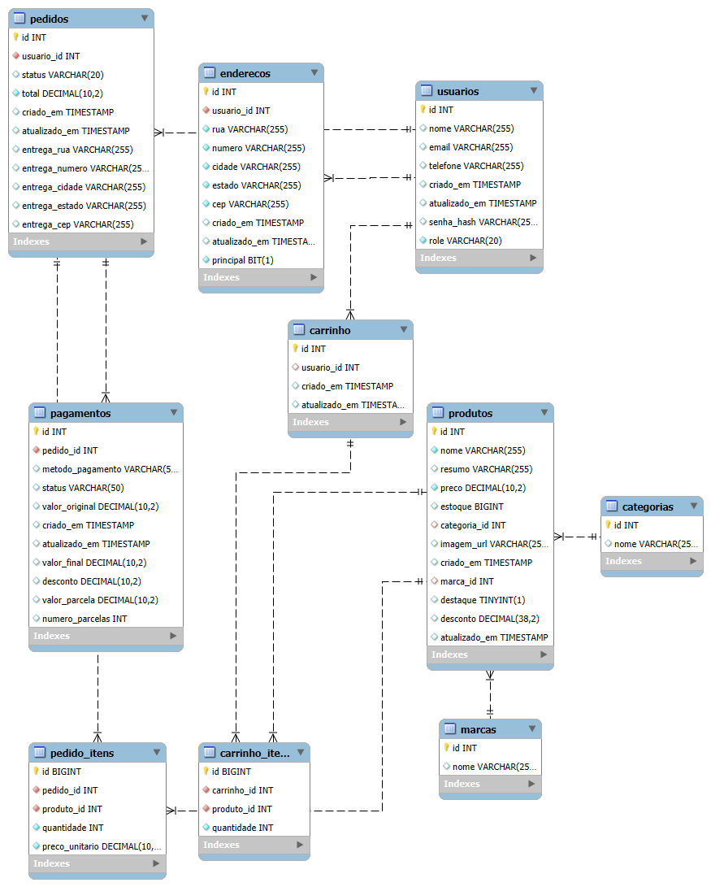

# GuliX - E-commerce de Hardwares


API RESTful de e-commerce desenvolvida com Java + Spring Boot, simulando um sistema completo de loja de hardware.

O projeto foi desenvolvido com foco em arquitetura backend, regras de negócio, autenticação segura, persistência de dados e modelagem relacional.


## Status
- Backend concluído

## Principais tecnologias utilizadas:

## Back-End:
- Java
- Spring MVC
- Spring Security
- Spring Data JPA
- Hibernate
- Lombok
- Maven
- JWT Authentication

## Banco de dados:
- MySQL

# Autenticação e Autorização:
- JWT/Spring Security

## Principais Funcionalidades

### Usuários e Segurança
- Registro e login de usuários
- Autenticação via JWT
- Autorização baseada em roles
- Criptografia de senha

### Produtos
- CRUD completo de produtos
- Categorias
- Marcas
- Controle de estoque
- Produtos em destaque
- Sistema de descontos

### Carrinho
- Adição e remoção de produtos
- Controle de quantidade de itens

### Pedidos
- Criação de pedidos
- Histórico de pedidos
- Controle de status
- Persistência do endereço de entrega

### Pagamentos
- Simulação de pagamento
- Controle de parcelas
- Aplicação de desconto

---

## Modelagem do Banco de Dados

O banco foi modelado considerando regras de negócio reais de um e-commerce, incluindo:

- Usuários
- Endereços
- Produtos
- Categorias
- Marcas
- Carrinho
- Pedidos
- Pagamentos

### DER do Projeto



---

## Como testar a API

A API pode ser executada localmente e testada através do Swagger/OpenAPI.

### Swagger
http://localhost:8080/swagger-ui/index.html

## Como Executar

Clone o projeto:

```bash
git clone URL_DO_REPOSITORIO 
```

Entre na pasta:

```bash
cd gulix-backend
```

Configure o banco no:

```properties
application.properties
```

Execute:

```bash
./mvnw spring-boot:run
```

---

## Autor

**Gustavo Nagai Amorim**

GitHub: https://github.com/gulinagai  
LinkedIn: https://www.linkedin.com/in/gustavo-nagai/